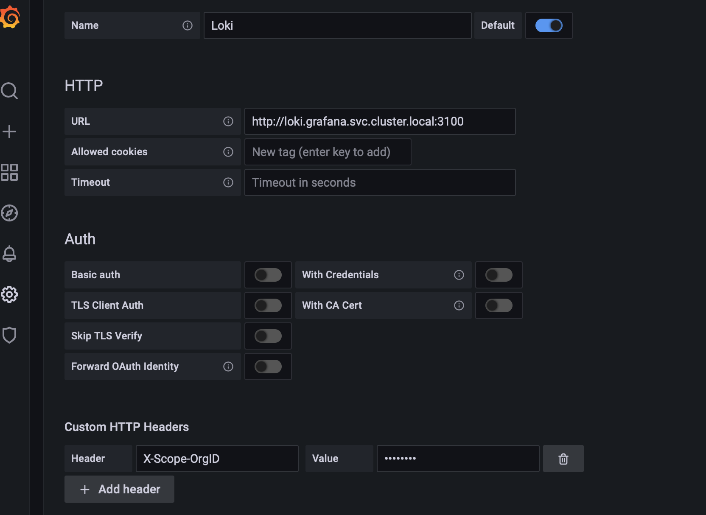

# Multi-tenant Observability with Grafana Loki

## TLDR

Simple walk through to get up and running with Grafana/Loki on a kubernetes cluster and multi-tenant observability configured in Loki.

Show me the code.

## Versions

Ingress-NGINX: 1.6.1
Grafana: 9.3.6
Grafana Loki: 2.7.2
Grafana Promtail: 2.7.2
Prometheus: v2.41.0

## Grafana and Loki

[Grafana Labs](https://grafana.com) is a visualization platform for encompassing observability across all application stacks. Grafana is a one stop solution for end to end observability stack and widely used across enterprises.

[Grafana Loki](https://grafana.com/oss/loki/) is a centralized log aggregation system for maintaining and querying logs.

Please refer to Grafana site for more information about Grafana and Loki. We will look at how to set up Grafana and Loki on a Kubernetes Cluster for Multi-Tenant observability.

We leverage [Prometheus](https://prometheus.io) for getting insights into cluster metrics. Most cloud providers provide metric collectors example Azure Container Insights, AWS Cloud Watch Container Insights which can be readily plugged into Grafana via Grafana Plugins.

## Sample Application

The sample application is a simple image processor, which allows tenants to upload an image and return image meta data ; mime-type and size. The application is not interesting at all, however this will do in demonstrating centralized logging, monitoring and metrics using Grafana and Loki in multi-tenant environment. The application is a SpringBoot implementation with a rest controller.

In the application various tenants call out image api service which is intercepted by public facing ingress and then routed to image api service for processing, cannot get any simpler.

The Image API service is provisioned in imageapi namespace.


The image api service exposes one endpoint for getting image metadata.

Since we are talking multi-tenant we need some way to log information about tenant in application logs to distinguish requests between tenants. The tenant id can come from request header, some security token etc.., in the sample application tenant id is passed as a parameter when service is invoked.


The sample application uses log4J2 for logging and logs to standard out using JSON logging via EcsLayout template. This requires log4j-layout-template-json dependency. JSON logging allows for structured logging and fields in log message parsed while aggregating in Loki.


```XML
<dependency>
  <groupId>org.apache.logging.log4j</groupId>
  <artifactId>log4j-layout-template-json</artifactId>
  <version>2.17.1</version>
</dependency>
```

The sample application generates following logging.

```JSON
{
    "@timestamp":"2022-05-01T21:10:51.451Z",
    "ecs.version":"1.2.0",
    "log.level":"DEBUG",
    "message":"Image Metadata size: 22813",
    "process.thread.name":"qtp1978462681-23",
    "log.logger":"com.malcolm.imageapi.ImageAPI","REQUEST_ID":"4c5fb205-65e4-4cff-8e13-a2573bba7b36",
    "TENANT_ID":"Tenant_1",
    "TRACE_ID":"520f7851-c397-4385-b9c6-9bfb750a7ff5",
    "source":{
        "className":"com.malcolm.imageapi.ImageAPI",
        "methodName":"validate",
        "fileName":"ImageAPI.java",
        "lineNumber":69
    }
}
```

Important to note that each log line contains TENANT_ID, this allows to query log data for a specific tenant and also apply some rules around accessing this data.

More over we generate trace id in service and log any client request id passed by the caller, This helps solidify logging and aids troubleshooting.

There are other ways using [Open-Telemetry](https://opentelemetry.io) to trace and span requests in more complex microservices but in our case generated request ids, trace ids should work fine.

We also expose metrics and prometheus data from SpringBoot application using, [SpringBoot actuator](https://docs.spring.io/spring-boot/docs/current/reference/html/actuator.html?query=health%27%20target=_blank%3E%3Cb%3Ehealth%3C/b%3E%3C/a%3E-groups).


The imageapi client that simulates multiple tenants is a simple Golang command line application that calls the service.


## Grafana / Loki

Grafana and Loki are provisioned in the grafana namespace. The expectation being tenant specific ops will access grafana dashboard and visualize log data for a given tenant.

.

Only Grafana dashboard accessible via ingress, Loki, Prometheus, Promtail all are runing within the cluster and not accessible outside of the cluster.

Now that we have a fair understanding about use case, we will perform the following actions to get up and running with Grafana and Loki with Multi Tenant Observability

- Provision Storage
  
- Provision Ingress Controller

- Generate TLS certificates

- Install Grafana

- Install Loki

- Install Promtail

- Install Prometheus
  
- Install the image api service
  
- Access and Configure Dashboards


Please do not be alarmed with so many install steps we leverage [Helm](https://helm.sh) charts so they are just one liners.

All steps are executed on command line from root folder.

I am using [minikube](https://minikube.sigs.k8s.io/docs/) for local cluster.

```shell
minikube version

minikube version: v1.25.2
commit: 362d5fdc0a3dbee389b3d3f1034e8023e72bd3a7

minikube config set cpus 4
❗  These changes will take effect upon a minikube delete and then a minikube start

minikube config set memory 5048
❗  These changes will take effect upon a minikube delete and then a minikube start


minikube start
😄  minikube v1.25.2 on Darwin 10.15.7
✨  Automatically selected the hyperkit driver. Other choices: virtualbox, sshs
```

## Provision Storage

Storage and retention policies around metrics and log data is very important. In this walk through we are using host system for storage. In a production system durable alternatives are needed. Please plan for amount of data and rentention policies.

[Please read about Loki Storage](https://grafana.com/docs/loki/latest/operations/storage/). This proof of concept is using file system storage. Please refer to [Loki Storage Retention Policies](https://grafana.com/docs/loki/latest/operations/storage/retention/) regarding additional configuration for data retention.

```shell
kubectl create namespace grafana

namespace/grafana created

kubectl apply -f 03_yaml/grafana-pv-pvc-minikube.yaml --namespace grafana

persistentvolumeclaim/grafana-volume-claim created
```

Confirm that the PV and PVC are created and bound.

```shell
kubectl get pv -A

NAME             CAPACITY   ACCESS MODES   RECLAIM POLICY   STATUS   CLAIM                          STORAGECLASS   REASON   AGE
grafana-volume   5Gi        RWO            Retain           Bound    grafana/grafana-volume-claim   Standard                9s

```

```shell
kubectl get pvc -A

NAMESPACE   NAME                   STATUS   VOLUME           CAPACITY   ACCESS MODES   STORAGECLASS   AGE
grafana     grafana-volume-claim   Bound    grafana-volume   5Gi        RWO             Standard      59s

```

Storage YAML files:

- grafana-pv-pvc-minikube.yaml
  - Persistent Volume Claim when running in Minikube uses dynamic storage provisioning.

- grafana-pv-pvc-dockerdesktop.yaml
  - Persistent Volume and Persistent Volume Claim when running in DockerDesktop on Mac volume needs to be provisioned in DockerDestop under preferences, resources, file sharing first.

- grafana-pv-pvc-dockerdesktop-wsl.yaml
  - Persistent Volume and Persistent Volume Claim when running in DockerDesktop on Windows via WSL, folders need to be created on host system first and then mapped to persistent volume using /run/desktop/mnt/host/c/ convention.

## Provision Ingress Controller

Provision ingress contoller, in case of minikube we just have to enable ingress addons. [Kubernetes NGINX Ingress Controller](https://kubernetes.github.io/ingress-nginx/) is the the default Ingress class that comes along with minikube.

```shell
minikube addons enable ingress

▪ Using image k8s.gcr.io/ingress-nginx/controller:v1.1.1
▪ Using image k8s.gcr.io/ingress-nginx/kube-webhook-certgen:v1.1.1
▪ Using image k8s.gcr.io/ingress-nginx/kube-webhook-certgen:v1.1.1
🔎  Verifying ingress addon...
🌟  The 'ingress' addon is enabled
```

In the case of other Kubenetes Clusters please install via helm chart.

```shell
helm repo add ingress-nginx https://kubernetes.github.io/ingress-nginx

helm repo update

##Ingress-NGINX Version 1.6.1, Helm Chart Version 4.4.3
helm upgrade --install ingress-nginx ingress-nginx/ingress-nginx --version 4.4.3 --namespace ingress-nginx --create-namespace

```

Confirm Ingress class was deployed and the ingress service is available.

```shell
kubectl get services -A
```

This should show ingress-nginx-controller and ingress-nginx-controller-admission services provisioned.

## Generate TLS certificates

We will use [CloudFlare CFSSL](https://cfssl.org) to generate trust material so that the imageapi service and grafana dashboard is accessed via https with SSL termination occuring at the ingress. CloudFlare cfssl can be easily installed on all operating systems or built from source.

#### 1. Generate CA for Self Signed TLS material

Confirm cfssl version before running commands.

```bash
cfssl version

Version: 1.6.1
Runtime: go1.17
```

Generate ca using cfssl. CA defintions in myaceme_ca.json file.

```bash
cfssl gencert -initca 02_tls/myaceme_ca.json | cfssljson -bare 02_tls/myaceme_ca

2022/04/29 18:49:46 [INFO] generating a new CA key and certificate from CSR
2022/04/29 18:49:46 [INFO] generate received request
2022/04/29 18:49:46 [INFO] received CSR
2022/04/29 18:49:46 [INFO] generating key: rsa-2048
2022/04/29 18:49:46 [INFO] encoded CSR
2022/04/29 18:49:46 [INFO] signed certificate with serial number 614045538385103150398837043280959282421471767182
```

#### 2. Generate self signed tls material for grafana dashboard

Defintion for tls certificate in grafana.json file, profile.json contains tls signing profiles.

```bash
cfssl gencert -ca 02_tls/myaceme_ca.pem -ca-key 02_tls/myaceme_ca-key.pem -config 02_tls/profile.json -profile=server 02_tls/grafana_tls/grafana.json | cfssljson -bare 02_tls/grafana_tls/grafana

2022/04/29 18:54:34 [INFO] generate received request
2022/04/29 18:54:34 [INFO] received CSR
2022/04/29 18:54:34 [INFO] generating key: rsa-2048
2022/04/29 18:54:34 [INFO] encoded CSR
2022/04/29 18:54:34 [INFO] signed certificate with serial number 124590712233076516768785810343258332253533015392
```

#### 3. Generate self signed tls material for imageapi service

Defintion for tls certificate in imageapi.json file, profile.json contains tls signing profiles.

```bash
cfssl gencert -ca 02_tls/myaceme_ca.pem -ca-key 02_tls/myaceme_ca-key.pem -config 02_tls/profile.json -profile=server 02_tls/imageapi_tls/imageapi.json | cfssljson -bare 02_tls/imageapi_tls/imageapi

2022/04/29 18:56:13 [INFO] generate received request
2022/04/29 18:56:13 [INFO] received CSR
2022/04/29 18:56:13 [INFO] generating key: rsa-2048
2022/04/29 18:56:13 [INFO] encoded CSR
2022/04/29 18:56:13 [INFO] signed certificate with serial number 43858409390059653480603204189057375942926449031
```

## Install Grafana

We add grafana tls secret so the same can be used by Grafana Ingress.

```shell
kubectl create secret tls grafana-ingress-tls --key 02_tls/grafana_tls/grafana-key.pem --cert 02_tls/grafana_tls/grafana.pem --namespace grafana  

secret/grafana-ingress-tls created
```

We add grafana helm repo and then install grafana chart via helm.

Please note the overide "--values 03_yaml/grafana-values.yaml", This values files contains ingress defintion along with tls secret and configuration for storage.

```shell

helm repo add grafana https://grafana.github.io/helm-charts

helm repo update

##Grafana Version 9.3.6, Helm Chart Version 6.50.6 
helm upgrade --install grafana grafana/grafana --version 6.50.6 --values 03_yaml/grafana-values.yaml --namespace grafana --create-namespace
```

If all is well, you should see following output:

```shell

Release "grafana" does not exist. Installing it now.
W0501 18:22:30.363934   50090 warnings.go:70] policy/v1beta1 PodSecurityPolicy is deprecated in v1.21+, unavailable in v1.25+
W0501 18:22:30.368409   50090 warnings.go:70] policy/v1beta1 PodSecurityPolicy is deprecated in v1.21+, unavailable in v1.25+
W0501 18:22:30.480730   50090 warnings.go:70] policy/v1beta1 PodSecurityPolicy is deprecated in v1.21+, unavailable in v1.25+
W0501 18:22:30.480731   50090 warnings.go:70] policy/v1beta1 PodSecurityPolicy is deprecated in v1.21+, unavailable in v1.25+
NAME: grafana
LAST DEPLOYED: Sun May  1 18:22:29 2022
NAMESPACE: grafana
STATUS: deployed
REVISION: 1
NOTES:

1. Get your 'admin' user password by running:

   kubectl get secret --namespace grafana grafana -o jsonpath="{.data.admin-password}" | base64 --decode ; echo

2. The Grafana server can be accessed via port 80 on the following DNS name from within your cluster:

   grafana.grafana.svc.cluster.local

   If you bind grafana to 80, please update values in values.yaml and reinstall:
   
   securityContext:
      runAsUser: 0
      runAsGroup: 0
      fsGroup: 0

   command:
    - "setcap"
    - "'cap_net_bind_service=+ep'"
    - "/usr/sbin/grafana-server &&"
    - "sh"
    - "/run.sh"
   
   
   Details refer to https://grafana.com/docs/installation/configuration/#http-port.
   Or grafana would always crash.

   From outside the cluster, the server URL(s) are:
   http://grafana.malcolm.io


  1. Login with the password from step 1 and the username: admin
```

Confirm that grafana was successfully deployed and running.

```shell
kubectl get pods --namespace grafana

NAME                       READY   STATUS    RESTARTS   AGE
grafana-77d44ccbff-sttjp   1/1     Running   0          4m21s
```

```shell
kubectl get services --namespace grafana

NAME      TYPE        CLUSTER-IP      EXTERNAL-IP   PORT(S)   AGE
grafana   ClusterIP   10.99.137.178   <none>        80/TCP    4m43s
```

Confirm that grafana ingress is available.

```shell
kubectl get ingress -A

NAMESPACE   NAME      CLASS    HOSTS                ADDRESS         PORTS     AGE
grafana     grafana   <none>   grafana.malcolm.io   192.168.64.23   80, 443   5m45s
```

Now add the ip address the the hosts file to that grafana dashboard can be accessed.

```shell
192.168.64.23 grafana.malcolm.io
```

Access [Grafana Dashboard](https://grafana.malcolm.io) using user name as admin.


But what is the password ? The instructions for this was displayed in the output from the helm install. We could aslo set admin password in grafana-values.yaml.

```shell
....
1. Get your 'admin' user password by running:

   kubectl get secret --namespace grafana grafana -o jsonpath="{.data.admin-password}" | base64 --decode ; echo
...

```

```shell
kubectl get secret --namespace grafana grafana -o jsonpath="{.data.admin-password}" | base64 --decode ; echo

x66M3z5gaVP5sWUlpbASiTuiEoiHLhJFOvAGQgG9
```


We have grafana running but it does not do anything since we do not have any data sources or data, lets configure that next.

## Install Loki

We already have grafana repo added to helm, so we can just install loki chart via helm.

Please note overide "--values 03_yaml/loki-values.yaml", This values files contains configuration for storage.

```shell

##Grafana Loki Version 2.7.2, Helm Chart Version 4.4.2  
helm upgrade --install loki grafana/loki --version 4.4.2 --values 03_yaml/loki-values.yaml --namespace grafana --create-namespace

```

You should see the following output when Loki is installed.

```shell
Release "loki" does not exist. Installing it now.
W0501 18:41:42.012528   51382 warnings.go:70] policy/v1beta1 PodSecurityPolicy is deprecated in v1.21+, unavailable in v1.25+
W0501 18:41:42.076079   51382 warnings.go:70] policy/v1beta1 PodSecurityPolicy is deprecated in v1.21+, unavailable in v1.25+
NAME: loki
LAST DEPLOYED: Sun May  1 18:41:41 2022
NAMESPACE: grafana
STATUS: deployed
REVISION: 1
TEST SUITE: None
NOTES:
Verify the application is working by running these commands:
  kubectl --namespace grafana port-forward service/loki 3100
  curl http://127.0.0.1:3100/api/prom/label
```

Confirm loki pods and services

```shell
kubectl get pods --namespace grafana

NAME                       READY   STATUS    RESTARTS   AGE
grafana-77d44ccbff-sttjp   1/1     Running   0          20m
loki-0                     1/1     Running   0          101s
```

```shell
kubectl get services --namespace grafana

grafana         ClusterIP   10.99.137.178   <none>        80/TCP     21m
loki            ClusterIP   10.104.137.92   <none>        3100/TCP   2m13s
loki-headless   ClusterIP   None            <none>        3100/TCP   2m13s
```

With Loki installed we are now ready to send data to Loki, which will be the centralized logging system.

How do we send data tto Loki. We use [PromTail](https://grafana.com/docs/loki/latest/clients/promtail/). Promtail will scrap logs and push them to loki.

## Install Promtail

We already have grafana helm repo added to our local helm so we can just install promtail.

```shell

##Grafana Promtail Version 2.7.2, Helm Chart Version 6.8.2 
helm upgrade --install promtail grafana/promtail --version 6.8.2  --values 03_yaml/promtail-values.yaml --namespace grafana

```

Please note overide "03_yaml/promtail-values.yaml", This where the multi tenant magic occurs as promtail parse the log messges and sends it to loki for the correct tenant organization. [Loki Multi Tenancy](https://grafana.com/docs/loki/latest/operations/multi-tenancy/)

This specifices location of the loki service

```yaml
clients:
- url: http://loki.grafana.svc.cluster.local:3100/loki/api/v1/push
```

The pipelines stages contains the stages to parse the json log message and extract the tenant information.

```yaml
pipelineStages:
      - match:
          selector: '{app!="imageapi"}'
          stages:
            - tenant:
                value: admin
      - match:
          selector: '{app="imageapi"}'
          stages:
            - json:
                expressions:
                  output: log
            - json:
                source: output
                expressions:
                  tenant_id: TENANT_ID
                  message: message
                  trace_id: TRACE_ID
                  request_id: REQUEST_ID
                  logger_name: logger_name
                  level: log.level
                  className: source.className
                  methodName: source.methodName
                  error_message: error.message
                  error_trace: error.stack_trace
            - labels:
                tenant_id:
                message:
                trace_id:
                request_id:
                className:
                methodName:
                error_message:
                error_trace:
            - tenant:
                source: tenant_id
```

You should see the following output when promtail is installed.

```shell
Release "promtail" does not exist. Installing it now.
NAME: promtail
LAST DEPLOYED: Sun May  1 18:56:16 2022
NAMESPACE: grafana
STATUS: deployed
REVISION: 1
TEST SUITE: None
NOTES:
***********************************************************************
 Welcome to Grafana Promtail
 Chart version: 4.2.0
 Promtail version: 2.5.0
***********************************************************************

Verify the application is working by running these commands:

* kubectl --namespace grafana port-forward daemonset/promtail 3101
* curl http://127.0.0.1:3101/metrics
```

Confirm promtail pods, there is promtail service, promtail is a daemon sets that will scrapes logs.

```shell
kubectl get pods --namespace grafana

grafana-77d44ccbff-sttjp   1/1     Running   0          34m
loki-0                     1/1     Running   0          15m
promtail-fjlwv             1/1     Running   0          47s
```

## Install Prometheus

We will add Prometheus Community repo to our helm install and install Prometheus which will be responsible for scraping metrics.

```shell

helm repo add prometheus-community https://prometheus-community.github.io/helm-charts

helm repo update

##Prometheus Version v2.41.0, Helm Chart Version 6.8.2 
helm upgrade --install prometheus prometheus-community/prometheus --version 19.3.3

```

Note: On DockerDesktp we get error regarding the node exported, please execute the following to resolve the node exporter error if one is encountered.

```shell

kubectl patch ds prometheus-node-exporter --type "json" -p '[{"op": "remove", "path" : "/spec/template/spec/containers/0/volumeMounts/2/mountPropagation"}]'
```

## Install ImageAPI Service

We will create imageapi namespace, create the imaeapi tls secret and install imagepai application.

```shell
kubectl create namespace imageapi

namespace/imageapi created


kubectl create secret tls imageapi-ingress-tls --key 02_tls/imageapi_tls/imageapi-key.pem --cert 02_tls/imageapi_tls/imageapi.pem --namespace imageapi

secret/imageapi-ingress-tls created

kubectl apply -f 03_yaml/imageapi.yaml --namespace imageapi

deployment.apps/imageapi created
service/imageapi created
ingress.networking.k8s.io/imageapi-ingress created
```

Confirm image api deployments and services are available.

```shell
kubectl get pods --namespace imageapi

NAME                        READY   STATUS    RESTARTS   AGE
imageapi-56757c94f8-nszhn   1/1     Running   0          82s

kubectl get services --namespace imageapi

NAME       TYPE        CLUSTER-IP       EXTERNAL-IP   PORT(S)    AGE
imageapi   ClusterIP   10.109.177.127   <none>        8080/TCP   40s
```

Confirm if the imageapi application ingress is available.

```shell
kubectl get ingress -A

NAMESPACE   NAME               CLASS    HOSTS                 ADDRESS         PORTS     AGE
grafana     grafana            <none>   grafana.malcolm.io    192.168.64.23   80, 443   44m
imageapi    imageapi-ingress   <none>   imageapi.malcolm.io   192.168.64.23   80, 443   2m11s
```

Add the ip address the hosts file.

```shell
192.168.64.23 imageapi.malcolm.io
```

Validate that [Image API Application](https://imageapi.malcolm.io/api.html)


This generates required logging and metrics for the walk through.

## Start the tenant applications

Open couple of terminal windows by tenant and fire away api invocations using imageapiclient application.


## Configure Grafana Dashboard

1. Create Orgs in Grafana
  

2. Create Users for org.
  

3. Create Loki datasource for each org. The admin will switch to each org and create a data source using the X-Scope-OrgID header.
  
  
  

  Need to create datasource using the X-Scope-OrgID http reader and value being Tenant_1 to Tenant_4.

  So there will be 1 datasource for each tenant.

  

  
  
  Click Add to Dashboard and create a new Dashboard.

  
  
4. Tenant specific ops access thier own datasource created by the admin

When a tenant specific ops logs on to grafana , they will see the daasource created for thier org and can use it as required to query logs for that tenant.


6. Configure Prometheus metrics


## All Commands

```shell
kubectl create namespace grafana

kubectl apply -f 03_yaml/grafana-pv-pvc-minikube.yaml --namespace grafana

helm repo add ingress-nginx https://kubernetes.github.io/ingress-nginx

helm repo update

helm upgrade --install ingress-nginx ingress-nginx/ingress-nginx --version 4.4.3 --namespace ingress-nginx --create-namespace

kubectl create secret tls grafana-ingress-tls --key 02_tls/grafana_tls/grafana-key.pem --cert 02_tls/grafana_tls/grafana.pem --namespace grafana  

helm repo add grafana https://grafana.github.io/helm-charts

helm repo update

helm upgrade --install grafana grafana/grafana --version 6.50.6 --values 03_yaml/grafana-values.yaml --namespace grafana --create-namespace

helm upgrade --install loki grafana/loki --version 4.4.2 --values 03_yaml/loki-values.yaml --namespace grafana --create-namespace

helm upgrade --install promtail grafana/promtail --version 6.8.2  --values 03_yaml/promtail-values.yaml --namespace grafana

helm repo add prometheus-community https://prometheus-community.github.io/helm-charts

helm repo update

helm upgrade --install prometheus prometheus-community/prometheus --version 19.3.3

kubectl patch ds prometheus-node-exporter --type "json" -p '[{"op": "remove", "path" : "/spec/template/spec/containers/0/volumeMounts/2/mountPropagation"}]'

kubectl create namespace imageapi

kubectl create secret tls imageapi-ingress-tls --key 02_tls/imageapi_tls/imageapi-key.pem --cert 02_tls/imageapi_tls/imageapi.pem --namespace imageapi

kubectl apply -f 03_yaml/imageapi.yaml --namespace imageapi

```


## Clean up

```shell

kubectl delete -f 03_yaml/imageapi.yaml --namespace imageapi

kubectl delete secret imageapi-ingress-tls --namespace imageapi

kubectl delete namespace imageapi

helm uninstall prometheus

helm uninstall promtail --namespace grafana

helm uninstall loki --namespace grafana

helm uninstall grafana --namespace grafana

helm uninstall ingress-nginx --namespace ingress-nginx

kubectl delete secret grafana-ingress-tls --namespace grafana 

kubectl delete -f 03_yaml/grafana-pv-pvc-minikube.yaml --namespace grafana

kubectl delete namespace grafana
```
